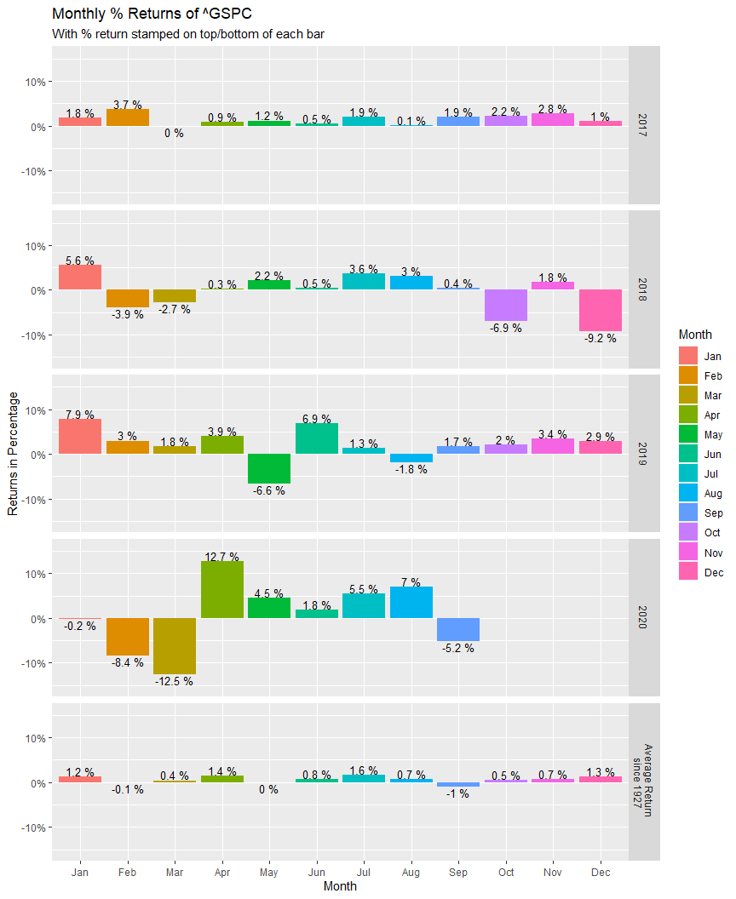
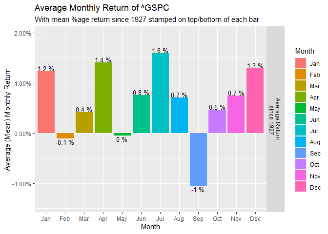

Introduction
------------

Institutional and Hedge Fund managers return from summer vacation and
adjust their financial portfolios at the end of each summer, causing a
selloff pressure in the market. September is considered a bad month for
the Bulls \[1\]

“Given that September tends to be a bad month for the market, I’m urging
you to be prepared …” Jim Cramer on CNBC, September 11, 2020.

For this and other reasons, such as election hypes, pandemic, etc.,
people with trading, investing or retirement portfolios may want to know
how their financial portfolios (or instruments such as stocks or ETFs in
their portfolios) performed over some years, months, weeks or days. They
may also want to know the average monthly, yearly, weekly or daily
returns, starting from some fixed time of start in the past to the
present or recent time.

Almost all portfolio managers measure performance with reference to a
benchmark \[3\]. In this short note, we will consider the historical
data of the Standard and Poor’s 500 Index (S&P 500, symbol=^GSPC) from
Yahoo! Finance, which is widely regarded as the best gauge of large-cap
U.S. equities. Other well known benchmarks include DOW-30, NASDAQ-100,
and the Russell 2000 Index for small-caps.

We will then outline a simple way to visualize or summarize monthly
returns as well as average monthly returns using R. Interested readers
can modify the instrument, period and length of time to their
preference.

We start by installing the R packages that will be needed to produce
libraries later. For more information about one of the key packages used
here, the `tidyquant` package, see \[2\].

    ## Load Packages for the libraries that will be needed
    ##install.packages(c("tidyquant","ggplot2","RColorBrewer","kableExtra"))

Getting and Preparing Data
--------------------------

We will get the data for the S&P 500 Index, symbol = ^GSPC, from Yahoo!
Finance. We will then prepare the data for visualization and/or
Summarization of results as needed.

    ##Get data 
    library(tidyquant)
    library(timetk)
    symbol <- tq_get("^GSPC",from = "1927-12-01", to = "2020-12-31", get = "stock.prices")
    symbolname<-"^GSPC" #we need this for reproducible labels of our plot outputs.

    ##Create a tibble, tb, for ^GSPC Monthly Returns. 
    tb<-tq_transmute(data=symbol, select = adjusted,mutate_fun = periodReturn, period = "monthly",col_rename = "Return")

This `tibble` has 1114 rows and 2 columns and you can view the head of
the data in any format you wish.

    library(kableExtra)
    head(tb) %>%
      kbl(caption = "Monthly Returns") %>%
      kable_classic(full_width = F, html_font = "Cambria") %>% kable_styling()

<table class=" lightable-classic table" style="font-family: Cambria; width: auto !important; margin-left: auto; margin-right: auto; margin-left: auto; margin-right: auto;">
<caption>
Monthly Returns
</caption>
<thead>
<tr>
<th style="text-align:left;">
date
</th>
<th style="text-align:right;">
Return
</th>
</tr>
</thead>
<tbody>
<tr>
<td style="text-align:left;">
1927-12-30
</td>
<td style="text-align:right;">
0.0000000
</td>
</tr>
<tr>
<td style="text-align:left;">
1928-01-31
</td>
<td style="text-align:right;">
-0.0050963
</td>
</tr>
<tr>
<td style="text-align:left;">
1928-02-29
</td>
<td style="text-align:right;">
-0.0176437
</td>
</tr>
<tr>
<td style="text-align:left;">
1928-03-30
</td>
<td style="text-align:right;">
0.1170337
</td>
</tr>
<tr>
<td style="text-align:left;">
1928-04-30
</td>
<td style="text-align:right;">
0.0243775
</td>
</tr>
<tr>
<td style="text-align:left;">
1928-05-31
</td>
<td style="text-align:right;">
0.0126582
</td>
</tr>
</tbody>
</table>

To make our work a bit easier, we create new columns of `Month` and
`Year` from the `date` column of `tb` and select only the columns we
want in the order of our desire. In addition to returns of each month by
year, we will be interested on the average (mean) monthly returns. To
that end, we will create new rows for the average monthly returns from
the beginning of the data (1927) to the present year (2020).

    ## Create new Year and Month Columns
    tb$Year<-format(as.Date(tb$date), format = "%Y")
    tb$Month<-format(as.Date(tb$date), format ="%b")
    tb$Month = factor(tb$Month, levels = month.abb) #lists abbreviated months in chronological order when plotting

    ## Select only the columns we need
    library(dplyr)
    tb<-select(tb, 3,4,2)

    ## include mean return in the plots (in adition to monthly returns). 
    agg = aggregate(tb$Return,by = list(month=tb$Month),FUN = mean)
    agg$Year<-"Average Return \n since 1927"
    colnames(agg) <- c("Month", "Return", "Year")
    agg<-select(agg, 3,1,2)
    tb<-rbind(tb,agg)
    head(tb)%>%
      kbl(caption = "Monthly Returns and Average Monthly Returns") %>%
      kable_classic(full_width = F, html_font = "Cambria") %>% kable_styling()

<table class=" lightable-classic table" style="font-family: Cambria; width: auto !important; margin-left: auto; margin-right: auto; margin-left: auto; margin-right: auto;">
<caption>
Monthly Returns and Average Monthly Returns
</caption>
<thead>
<tr>
<th style="text-align:left;">
Year
</th>
<th style="text-align:left;">
Month
</th>
<th style="text-align:right;">
Return
</th>
</tr>
</thead>
<tbody>
<tr>
<td style="text-align:left;">
1927
</td>
<td style="text-align:left;">
Dec
</td>
<td style="text-align:right;">
0.0000000
</td>
</tr>
<tr>
<td style="text-align:left;">
1928
</td>
<td style="text-align:left;">
Jan
</td>
<td style="text-align:right;">
-0.0050963
</td>
</tr>
<tr>
<td style="text-align:left;">
1928
</td>
<td style="text-align:left;">
Feb
</td>
<td style="text-align:right;">
-0.0176437
</td>
</tr>
<tr>
<td style="text-align:left;">
1928
</td>
<td style="text-align:left;">
Mar
</td>
<td style="text-align:right;">
0.1170337
</td>
</tr>
<tr>
<td style="text-align:left;">
1928
</td>
<td style="text-align:left;">
Apr
</td>
<td style="text-align:right;">
0.0243775
</td>
</tr>
<tr>
<td style="text-align:left;">
1928
</td>
<td style="text-align:left;">
May
</td>
<td style="text-align:right;">
0.0126582
</td>
</tr>
</tbody>
</table>

The last 12 rows contain the average (mean) monthly returns from the
start date of the data to the present year, preceded by the monthly
returns of the most recent years. Since this note is written in
September of 2020, the 2020 data is only for 9 months at this writing.

    tail(tb,n=34) %>%
      kbl(caption = "Monthly Returns and Average Monthly Returns") %>%
      kable_classic(full_width = F, html_font = "Cambria")

<table class=" lightable-classic" style="font-family: Cambria; width: auto !important; margin-left: auto; margin-right: auto;">
<caption>
Monthly Returns and Average Monthly Returns
</caption>
<thead>
<tr>
<th style="text-align:left;">
Year
</th>
<th style="text-align:left;">
Month
</th>
<th style="text-align:right;">
Return
</th>
</tr>
</thead>
<tbody>
<tr>
<td style="text-align:left;">
2018
</td>
<td style="text-align:left;">
Dec
</td>
<td style="text-align:right;">
-0.0917769
</td>
</tr>
<tr>
<td style="text-align:left;">
2019
</td>
<td style="text-align:left;">
Jan
</td>
<td style="text-align:right;">
0.0786844
</td>
</tr>
<tr>
<td style="text-align:left;">
2019
</td>
<td style="text-align:left;">
Feb
</td>
<td style="text-align:right;">
0.0297289
</td>
</tr>
<tr>
<td style="text-align:left;">
2019
</td>
<td style="text-align:left;">
Mar
</td>
<td style="text-align:right;">
0.0179243
</td>
</tr>
<tr>
<td style="text-align:left;">
2019
</td>
<td style="text-align:left;">
Apr
</td>
<td style="text-align:right;">
0.0393135
</td>
</tr>
<tr>
<td style="text-align:left;">
2019
</td>
<td style="text-align:left;">
May
</td>
<td style="text-align:right;">
-0.0657777
</td>
</tr>
<tr>
<td style="text-align:left;">
2019
</td>
<td style="text-align:left;">
Jun
</td>
<td style="text-align:right;">
0.0689302
</td>
</tr>
<tr>
<td style="text-align:left;">
2019
</td>
<td style="text-align:left;">
Jul
</td>
<td style="text-align:right;">
0.0131282
</td>
</tr>
<tr>
<td style="text-align:left;">
2019
</td>
<td style="text-align:left;">
Aug
</td>
<td style="text-align:right;">
-0.0180916
</td>
</tr>
<tr>
<td style="text-align:left;">
2019
</td>
<td style="text-align:left;">
Sep
</td>
<td style="text-align:right;">
0.0171812
</td>
</tr>
<tr>
<td style="text-align:left;">
2019
</td>
<td style="text-align:left;">
Oct
</td>
<td style="text-align:right;">
0.0204318
</td>
</tr>
<tr>
<td style="text-align:left;">
2019
</td>
<td style="text-align:left;">
Nov
</td>
<td style="text-align:right;">
0.0340470
</td>
</tr>
<tr>
<td style="text-align:left;">
2019
</td>
<td style="text-align:left;">
Dec
</td>
<td style="text-align:right;">
0.0285898
</td>
</tr>
<tr>
<td style="text-align:left;">
2020
</td>
<td style="text-align:left;">
Jan
</td>
<td style="text-align:right;">
-0.0016281
</td>
</tr>
<tr>
<td style="text-align:left;">
2020
</td>
<td style="text-align:left;">
Feb
</td>
<td style="text-align:right;">
-0.0841105
</td>
</tr>
<tr>
<td style="text-align:left;">
2020
</td>
<td style="text-align:left;">
Mar
</td>
<td style="text-align:right;">
-0.1251193
</td>
</tr>
<tr>
<td style="text-align:left;">
2020
</td>
<td style="text-align:left;">
Apr
</td>
<td style="text-align:right;">
0.1268440
</td>
</tr>
<tr>
<td style="text-align:left;">
2020
</td>
<td style="text-align:left;">
May
</td>
<td style="text-align:right;">
0.0452818
</td>
</tr>
<tr>
<td style="text-align:left;">
2020
</td>
<td style="text-align:left;">
Jun
</td>
<td style="text-align:right;">
0.0183884
</td>
</tr>
<tr>
<td style="text-align:left;">
2020
</td>
<td style="text-align:left;">
Jul
</td>
<td style="text-align:right;">
0.0551013
</td>
</tr>
<tr>
<td style="text-align:left;">
2020
</td>
<td style="text-align:left;">
Aug
</td>
<td style="text-align:right;">
0.0700647
</td>
</tr>
<tr>
<td style="text-align:left;">
2020
</td>
<td style="text-align:left;">
Sep
</td>
<td style="text-align:right;">
-0.0516640
</td>
</tr>
<tr>
<td style="text-align:left;">
Average Return since 1927
</td>
<td style="text-align:left;">
Jan
</td>
<td style="text-align:right;">
0.0123258
</td>
</tr>
<tr>
<td style="text-align:left;">
Average Return since 1927
</td>
<td style="text-align:left;">
Feb
</td>
<td style="text-align:right;">
-0.0011168
</td>
</tr>
<tr>
<td style="text-align:left;">
Average Return since 1927
</td>
<td style="text-align:left;">
Mar
</td>
<td style="text-align:right;">
0.0041122
</td>
</tr>
<tr>
<td style="text-align:left;">
Average Return since 1927
</td>
<td style="text-align:left;">
Apr
</td>
<td style="text-align:right;">
0.0140813
</td>
</tr>
<tr>
<td style="text-align:left;">
Average Return since 1927
</td>
<td style="text-align:left;">
May
</td>
<td style="text-align:right;">
-0.0004602
</td>
</tr>
<tr>
<td style="text-align:left;">
Average Return since 1927
</td>
<td style="text-align:left;">
Jun
</td>
<td style="text-align:right;">
0.0075405
</td>
</tr>
<tr>
<td style="text-align:left;">
Average Return since 1927
</td>
<td style="text-align:left;">
Jul
</td>
<td style="text-align:right;">
0.0159214
</td>
</tr>
<tr>
<td style="text-align:left;">
Average Return since 1927
</td>
<td style="text-align:left;">
Aug
</td>
<td style="text-align:right;">
0.0070290
</td>
</tr>
<tr>
<td style="text-align:left;">
Average Return since 1927
</td>
<td style="text-align:left;">
Sep
</td>
<td style="text-align:right;">
-0.0104641
</td>
</tr>
<tr>
<td style="text-align:left;">
Average Return since 1927
</td>
<td style="text-align:left;">
Oct
</td>
<td style="text-align:right;">
0.0046096
</td>
</tr>
<tr>
<td style="text-align:left;">
Average Return since 1927
</td>
<td style="text-align:left;">
Nov
</td>
<td style="text-align:right;">
0.0074612
</td>
</tr>
<tr>
<td style="text-align:left;">
Average Return since 1927
</td>
<td style="text-align:left;">
Dec
</td>
<td style="text-align:right;">
0.0129007
</td>
</tr>
</tbody>
</table>

Visualizing the tidy data
-------------------------

We can now visualize the data to our liking. A column plot (bar plot) of
monthly returns during the most recent five years (four years and nine
months since this note was written in September) with a plot of Average
Monthly Return (since 1927) of each month at the bottom may be done as
follows.

    ## Plot using ggplot2
    library(ggplot2)
    library(scales)
    g<-ggplot(data=tb[(length(tb$Return)-(4*12+9)+1):length(tb$Return),], aes(x=Month, y=Return)) 
    g<-g+geom_col(aes(fill = Month), position = "dodge")
    g<-g+facet_grid(rows = vars(Year))
    g<-g+labs(title=paste("Monthly % Returns of", symbolname),subtitle="With % return stamped on top/bottom of each bar")
    g<-g+geom_text(aes(label = paste(round(Return*100,1), "%"), vjust = ifelse(Return >= 0, -0.1, 1.1)), size=3.5)  
    g<-g+scale_y_continuous("Returns in Percentage", labels = percent_format(),expand = expansion(mult = c(0.2, 0.2))) 
    g

If we are interested in a separate plot for the Average (mean) Monthly
Return of each month (from 1927 to the present day), we can select the
last 12 rows of `tb` and use the same code. We also need to adjust the
title and labels of the axes.

    ## Plot using ggplot2 
    library(ggplot2)
    library(scales)
    g<-ggplot(data=tb[(length(tb$Return)-12+1):length(tb$Return),], aes(x=Month, y=Return)) 
    g<-g+geom_col(aes(fill = Month), position = "dodge")
    g<-g+facet_grid(rows = vars(Year))
    g<-g+labs(title=paste("Average Monthly Return of", symbolname),subtitle="With mean %age return since 1927 stamped on top/bottom of each bar")
    g<-g+geom_text(aes(label = paste(round(Return*100,1), "%"), vjust = ifelse(Return >= 0, -0.1, 1.1)), size=3.5)  
    g<-g+scale_y_continuous("Average (Mean) Monthly Return", labels = percent_format(),expand = expansion(mult = c(0.2, 0.2))) 
    g

Summarizing other important tales
---------------------------------

There were several interesting market events in history. Interested
readers may use codes and data to get summary of results in the format
of their liking. For example, if we are interested in the list of the
fifteen worst days of the S&P 500 Index, we can run the following chunk.

    symbol2 <- tq_get("^GSPC",from = "1928-01-01", to = "2020-12-31", get = "stock.prices")
    tb2<-tq_transmute(data=symbol2, select = adjusted,mutate_fun = periodReturn, period = "daily",col_rename = "Return")
    tb2<-tb2[order(tb2$Return,decreasing = FALSE),]
    tb2$Return<-paste(round(100*(tb2$Return),1),"%")
    head(tb2, n=15) %>% kbl(caption = "Worst historical days of market") %>% kable_classic(full_width = F, html_font = "Cambria")

<table class=" lightable-classic" style="font-family: Cambria; width: auto !important; margin-left: auto; margin-right: auto;">
<caption>
Worst historical days of market
</caption>
<thead>
<tr>
<th style="text-align:left;">
date
</th>
<th style="text-align:left;">
Return
</th>
</tr>
</thead>
<tbody>
<tr>
<td style="text-align:left;">
1987-10-19
</td>
<td style="text-align:left;">
-20.5 %
</td>
</tr>
<tr>
<td style="text-align:left;">
1929-10-28
</td>
<td style="text-align:left;">
-12.9 %
</td>
</tr>
<tr>
<td style="text-align:left;">
2020-03-16
</td>
<td style="text-align:left;">
-12 %
</td>
</tr>
<tr>
<td style="text-align:left;">
1929-10-29
</td>
<td style="text-align:left;">
-10.2 %
</td>
</tr>
<tr>
<td style="text-align:left;">
1935-04-16
</td>
<td style="text-align:left;">
-10 %
</td>
</tr>
<tr>
<td style="text-align:left;">
1929-11-06
</td>
<td style="text-align:left;">
-9.9 %
</td>
</tr>
<tr>
<td style="text-align:left;">
1946-09-03
</td>
<td style="text-align:left;">
-9.9 %
</td>
</tr>
<tr>
<td style="text-align:left;">
2020-03-12
</td>
<td style="text-align:left;">
-9.5 %
</td>
</tr>
<tr>
<td style="text-align:left;">
1937-10-18
</td>
<td style="text-align:left;">
-9.1 %
</td>
</tr>
<tr>
<td style="text-align:left;">
1931-10-05
</td>
<td style="text-align:left;">
-9.1 %
</td>
</tr>
<tr>
<td style="text-align:left;">
2008-10-15
</td>
<td style="text-align:left;">
-9 %
</td>
</tr>
<tr>
<td style="text-align:left;">
2008-12-01
</td>
<td style="text-align:left;">
-8.9 %
</td>
</tr>
<tr>
<td style="text-align:left;">
1933-07-20
</td>
<td style="text-align:left;">
-8.9 %
</td>
</tr>
<tr>
<td style="text-align:left;">
2008-09-29
</td>
<td style="text-align:left;">
-8.8 %
</td>
</tr>
<tr>
<td style="text-align:left;">
1933-07-21
</td>
<td style="text-align:left;">
-8.7 %
</td>
</tr>
</tbody>
</table>

Readers who are curious to know what happened during those historical
days may consult the literature. For example, the infamous day
`1987-10-19` happens to be what is known in market history as the Black
Monday; the crashes in October of 1929 signaled the beginning of the
Great Depression, see e.g. \[4\].

Readers interested in similar or more interesting results that may be
check using (R-) codes may consult Hirsch’s book \[1\].

References
----------

`[1]` Jeffrey A. Hirsch, *Stock Trader’s Almanac 2020 (Almanac Investor
Series),* 16th Edition, ISBN-13: 978-1119596295.

[`[2]` M. Dancho & D. Vaughan, *Tidy Quantitative Financial Analysis,*
The Comprehensive R Archive Network (CRAN), July 2,
2020.](https://cran.r-project.org/web/packages/tidyquant/tidyquant.pdf)

[`[3]` Y. Lu and D. Kane, *Performance Attribution for Equity
Portfolios,* The R Journal, Vol. 5/2, December
2013](https://journal.r-project.org/archive/2013-2/lu-kane.pdf)

`[4]` S. Nations, C. Grove, et al., *A History of the United States in
Five Crashes: Stock Market Meltdowns That Defined a Nation, *William
Morrow (Publisher); 1st Edition, June 13, 2017.
